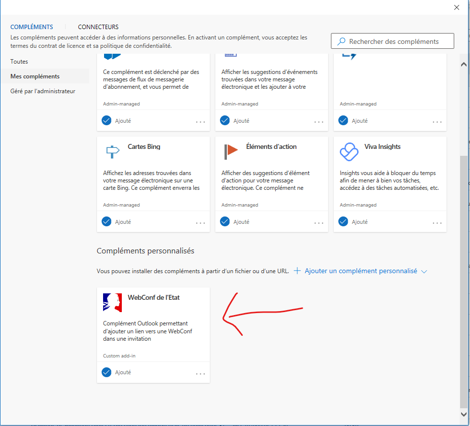
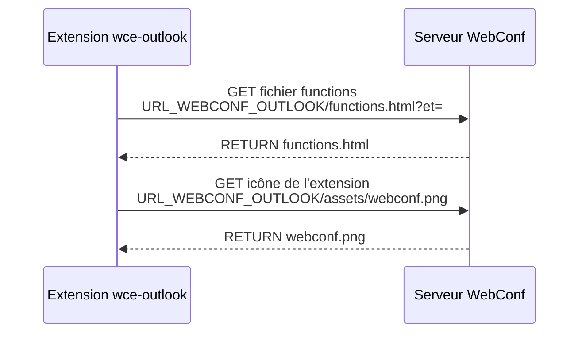
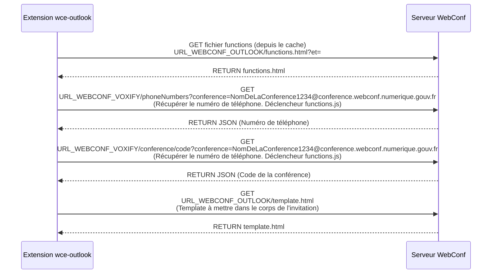

# wce-outlook

**wce-outlook** est un Add-in Outlook de la WebConf de l'Etat (https://webconf.numerique.gouv.fr) qui permet de générer un lien WebConf et ses coordonnées téléphoniques dans une invitation.
Le nom de la conférence est généré aléatoirement (entre 10 et 16 caractères alphanumériques).  
URL de l'add-in : [https://webconf.numerique.gouv.fr/wce-outlook/manifest.xml](https://webconf.numerique.gouv.fr/wce-outlook/manifest.xml).

# Installation
## Utilisateur Outlook 
Si vous êtes utilisateur Outlook, vous devez suivre les étapes ci-dessous : (Si vous êtes administrateur Outlook et que vous souhaitez diffuser l'Add-in vers l'ensemble de vos utilisateurs, suivez les étapes  dans la section [section administrateur outlook](#administrateur-outlook).)
 - Cliquez sur le bouton "Rechercher des compléments" dans le menu "Accueil"

 - Cliquez sur "Mes compléments", puis sur "Ajouter un complément personnalisé" => "à partir d'une URL"
 - Saissiez l'URL suivante https://webconf.numerique.gouv.fr/wce-outlook/manifest.xml. L'Add-in devrait s'afficher dans la liste des compléments personnalisés : 

 
## Administrateur Outlook 

### Microsoft 365
Si vous êtes administrateur Outlook sur Office 365. Il est recommandé de suivre la documentation de Microsoft et d'ajouter l'URL de l'add-in.
- Lien vers la documentation : [https://learn.microsoft.com/fr-fr/microsoft-365/admin/manage/manage-deployment-of-add-ins?view=o365-worldwide](https://learn.microsoft.com/fr-fr/microsoft-365/admin/manage/manage-deployment-of-add-ins?view=o365-worldwide)
- Lien vers l'Add-in : https://webconf.numerique.gouv.fr/wce-outlook/manifest.xml
### Exchange Server
Si vous êtes administrateur Outlook sur un serveur Exchange. Il est recommandé de suivre la documentation de Microsoft et d'ajouter l'URL de l'add-in.
- Lien vers la documentation : [https://learn.microsoft.com/fr-fr/exchange/add-ins-for-outlook-2013-help](https://learn.microsoft.com/fr-fr/exchange/add-ins-for-outlook-2013-help)
- Lien vers l'Add-in : https://webconf.numerique.gouv.fr/wce-outlook/manifest.xml

# Utilisation
- Créez un nouvel événement dans votre agenda
- Dans la page de création de l'événement, cliquez sur le bouton "Ajouter un lien WebConf" (parfois il faut cliquer le bouton "autres commandes" pour y accéder)
- Votre invitation devrait ressembler à la capture d'écran ci-dessous : 
 

# Matrices de flux
- URL_WEBCONF_OUTLOOK : https://webconf.numerique.gouv.fr/wce-outlook
- URL_WEBCONF_VOXIFY : https://webconf.numerique.gouv.fr/voxapi/api/v1/conn/jitsi

## A l'ouverture de la fenêtre "Nouvel événement" 

## Au clic sur le bouton "WebConf de l'Etat"

# Environnement de développement 
Pour mettre en place l'environnement de développement, il est recommandé de suivre la documentation Microsoft : 
https://learn.microsoft.com/en-us/office/dev/add-ins/quickstarts/outlook-quickstart?tabs=yeomangenerator
 
 # Contact
Pour toute demande d'assistance. Vous devez vous adresser à vos assistants informatiques de proximité.
S'ils ne parviennent pas à résoudre votre problème, ils peuvent nous écrire à cette adresse :
assistance@webconf.numerique.gouv.fr

