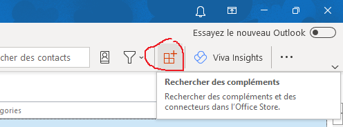

# wce-outlook

**wce-outlook** est un Add-in Outlook de la WebConf de l'Etat (https://webconf.numerique.gouv.fr) qui permet de générer un lien WebConf et ses coordonnées téléphoniques dans une invitation.
Le nom de la conférence est généré aléatoirement (entre 10 et 16 caractères alphanumériques).

# Installation
## Utilisateur Outlook 
Si vous êtes utilisateur Outlook, vous devez suivre les étapes ci-dessous : (Si vous êtes administrateur Outlook et que vous souhaitez diffuser l'Add-in vers l'ensemble de vos utilisateurs, suivez les étapes  dans la section [section administrateur outlook](#administrateur-outlook-outlook))
 - Cliquez sur le bouton "Rechercher des compléments" dans le menu "Accueil"

 - Cliquez sur "Mes compléments", puis sur "Ajouter un complément personnalisé" => "à partir d'une URL"
 - Saissiez l'URL suivante https://webconf.numerique.gouv.fr/wce-outlook/manifest.xml. L'Add-in devarit s'afficher dans la liste des compléments personnalisés : 
 
## Administrateur Outlook Outlook 

